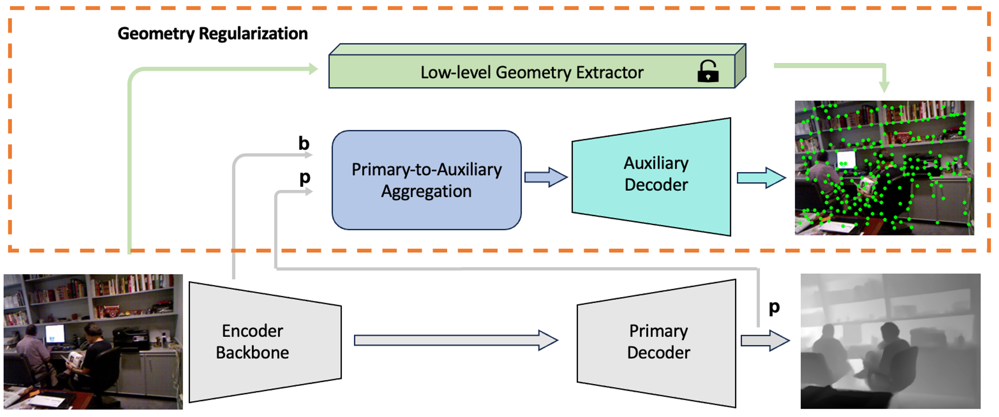

# When low-vision task meets dense prediction tasks with less data: an auxiliary self-trained geometry regularization
This repository is for the paper "When low-vision task meets dense prediction tasks with less data: an auxiliary self-trained geometry regularization", accepted by TMLR

<div align="center">
  
</div>

## Task1: Generalized Few-shot Semantic Segmentation (GFSS)

### Requirements
The code is verified with Python 3.6 and PyTorch 1.8. It also relies on NumPy and OpenCV.

### Datasets
Please refer to [PFENet](https://github.com/dvlab-research/PFENet) to get PASCAL VOC with SBD and COCO 2014. The ground truth images for COCO 2014 can be generated using `utils/coco_parse_script.py`. Data paths should be as follows:
```
.{YOUR_PASCAL_PATH}
├── JPEGImages
├── SegmentationClassAug

.{YOUR_COCO_PATH}
├── train2014
├── train_no_crowd
├── val2014
├── val_no_crowd
```
After the first stage training, the code will save the filenames for each class as txt files in `dataset/list/`. Then, you can use `utils/gen_fs_list.py` to select few-shot data for the second stage training with different random seeds.

### Pretrained Models
Download ImageNet pretrained ResNet-50 [here](https://drive.google.com/file/d/1w5pRmLJXvmQQA5PtCbHhZc_uC4o0YbmA/view). Check [models](./MODELS.md) to get pretrained POP models.

## GFSS Baseline1: Learning Orthogonal Prototypes (POP) 

POP performs two-stage training for generalized few-shot semantic segmentation.

### Stage 1: Base Class Learning
We use 1 GPU to train a base model on PASCAL-5i and 4 GPUs on COCO-20i. Run the training code with `scripts/train_coco_fold0_base_q.sh` and `scripts/train_voc_fold0_base.sh`. You should modify the arguments according to your settings. Note that you should specify `YOUR_RESTORE_PATH` as the path to ImageNet-pretrained ResNet-50 models.
### Stage 2: Novel Class Updating
Run the training code with `scripts/ft_coco.sh` and `scripts/ft_voc.sh` with modified arguments according to your settings. While `ft_pop.py` also supports larger batch size with multi-gpu training, we find small batch size often works better. Note that you should specify `YOUR_RESTORE_PATH` as the path to the base models trained in Stage 1. You can also finetune them on different support data by setting multiple random seeds.
### FP16 Training
To additionally speed up the training process, we support mix precision training in `train_base.py` and `ft_pop.py`, which can significantly reduce the time cost. To enable it, you can add `--fp16` in the training scripts.
### Testing
Use `scripts/evaluate_coco_fold0.sh` and `scripts/evaluate_voc_fold0.sh` to perform GFSS evaluation on the two datasets.

## GFSS Baseline2:  Context-Aware Prototype Learning (CAPL) 

### Run Demo / Test with Pretrained Models
+ Execute `mkdir initmodel` at the root directory.
+ Download the ImageNet pretrained [**backbones**](https://mycuhk-my.sharepoint.com/:u:/g/personal/1155122171_link_cuhk_edu_hk/EQEY0JxITwVHisdVzusEqNUBNsf1CT8MsALdahUhaHrhlw?e=4%3a2o3XTL&at=9) and put them into the `initmodel` directory.
+ Please download the pretrained models.
+ We provide **16 pre-trained**  [**models**](https://mycuhk-my.sharepoint.com/:f:/g/personal/1155122171_link_cuhk_edu_hk/Ej4c5aUV1RxDpXuSjK-9BZYBKF23mgq2zR8bNYWTkIJtkA?e=Rhb1xi): 
8 for 1/5 shot results on PASCAL-5i and 8 for COCO.
+ Update the config files by speficifying the target **split**, **weights** and **shot** for loading different checkpoints.

Note: The pre-trained models are re-trained by this repo, and you should be able to get generally comparable or slightly better performance than the ones reported in our paper.


### Train / Evaluate
+ For training, please set the option **only_evaluate** to **False** in the configuration file. Then execute this command at the root directory: 

    sh train.sh {*dataset*} {*model_config*}
    
+ For evaluation only, please set the option **only_evaluate** to **True** in the corresponding configuration file. 

    
Example: Train / Evaluate CAPL with 1-shot on the split 0 of PASCAL-5i: 

    sh train_agggate.sh pascal split0_1shot   

Example: Train / Evaluate CAPL with 1-shot on the split 0 of COCO: 

    sh train_agggate.sh coco_agg split0_1shot   

### References
This repo is mainly built based on [POP](https://github.com/lsa1997/POP) and [GFS-Seg](https://github.com/dvlab-research/GFS-Seg). Thanks for their great work!

## Task2: Monocular Depth Estimation

We implement our approach with 
**NeW CRFs: Neural Window Fully-connected CRFs for Monocular Depth Estimation.** <br />

### Installation
```
conda create -n newcrfs python=3.8
conda activate newcrfs
conda install pytorch=1.10.0 torchvision cudatoolkit=11.1
pip install matplotlib, tqdm, tensorboardX, timm, mmcv
```

### Datasets
You can prepare the datasets KITTI and NYUv2 according to [here](https://github.com/cleinc/bts), and then modify the data path in the config files to your dataset locations.

Or you can download the NYUv2 data from [here](https://virutalbuy-public.oss-cn-hangzhou.aliyuncs.com/share/newcrfs/datasets/nyu/sync.zip) and download the KITTI data from [here](http://www.cvlibs.net/datasets/kitti/eval_depth.php?benchmark=depth_prediction).


### Training
First download the pretrained encoder backbone from [here](https://github.com/microsoft/Swin-Transformer), and then modify the pretrain path in the config files.

Training the NYUv2 model:
```
python newcrfs/train.py configs/arguments_train_nyu.txt
```

Training the KITTI model:
```
python newcrfs/train.py configs/arguments_train_kittieigen.txt
```


### Demo
Test images with the indoor model:
```
python newcrfs/test.py --data_path datasets/test_data --dataset nyu --filenames_file data_splits/test_list.txt --checkpoint_path model_nyu.ckpt --max_depth 10 --save_viz
```

### Acknowledgements
Thanks to Weihao Yuan for opening source of the excellent work [New CRFs](https://github.com/aliyun/NeWCRFs).
Thanks to Microsoft Research Asia for opening source of the excellent work [Swin Transformer](https://github.com/microsoft/Swin-Transformer).